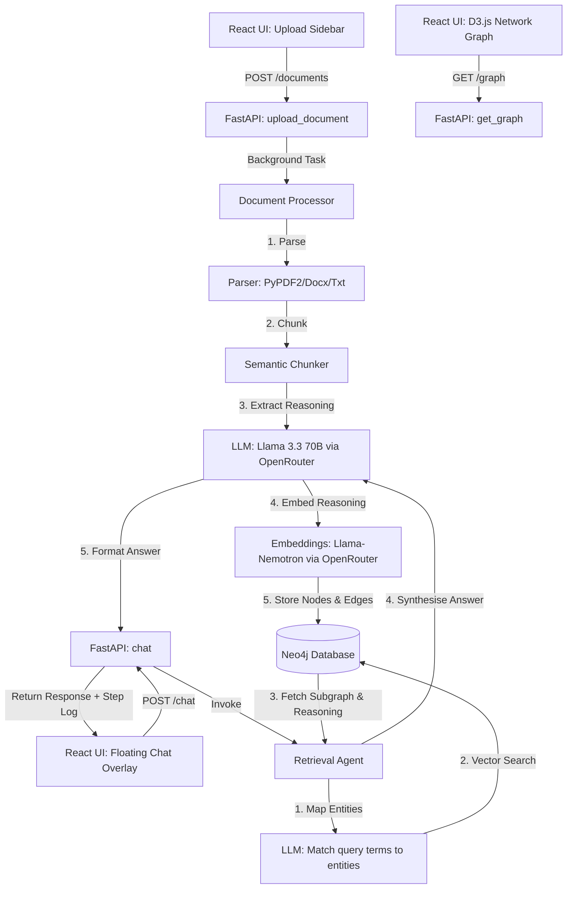
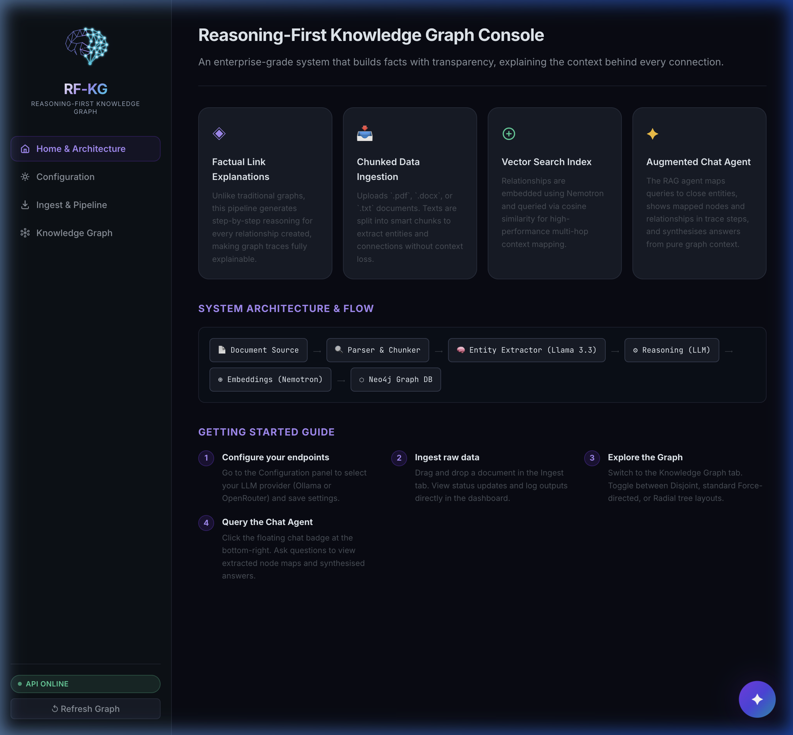
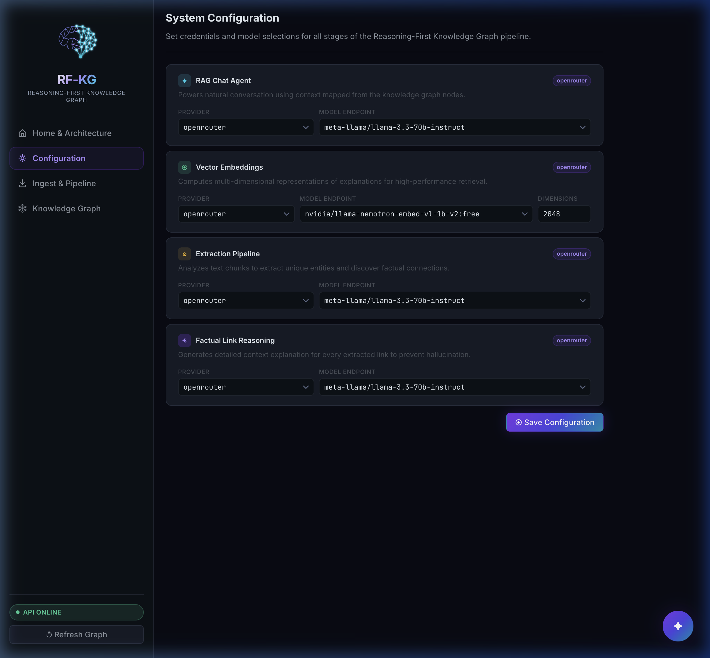
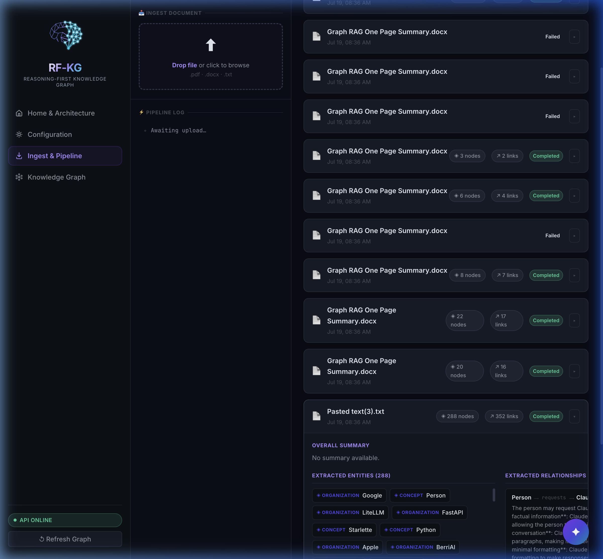
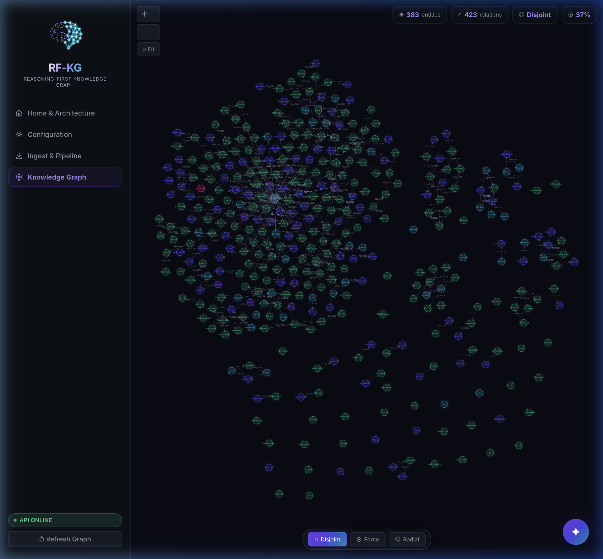
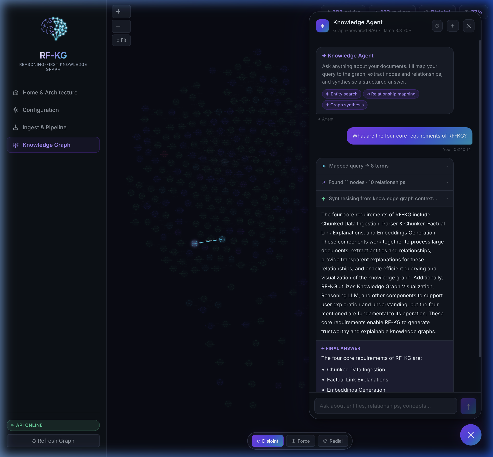
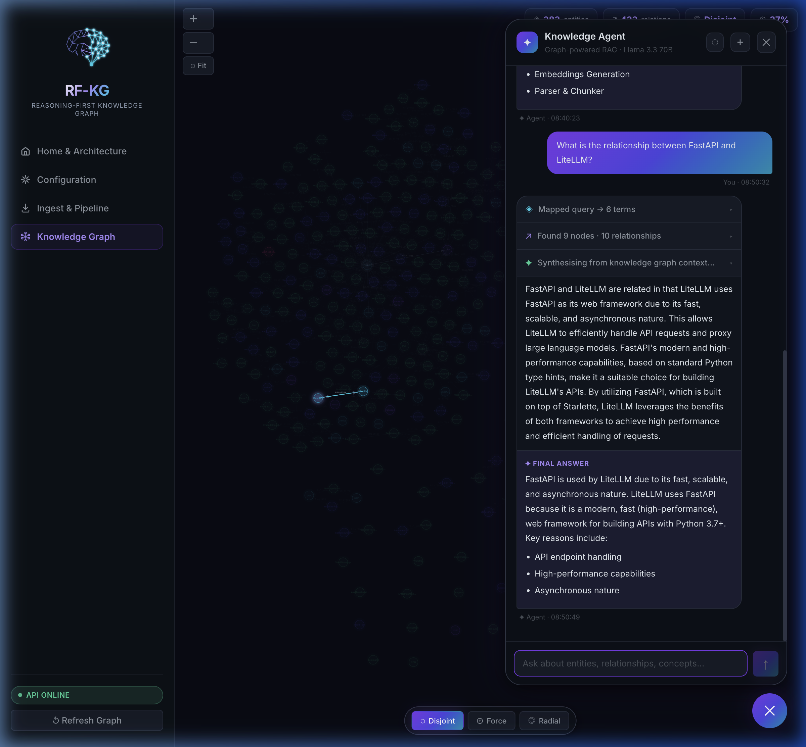
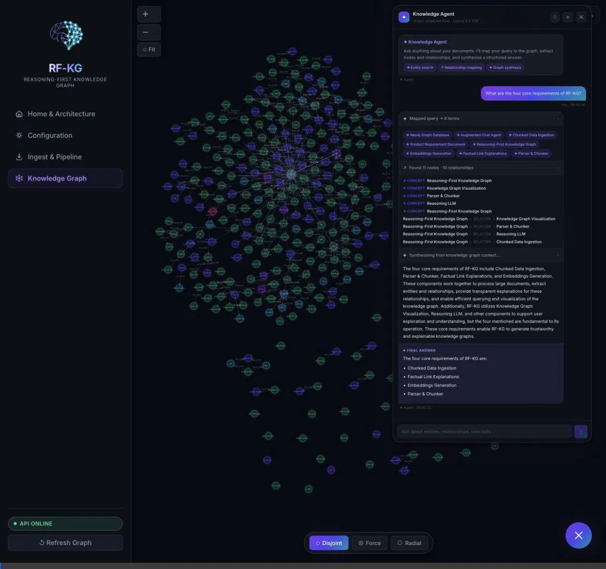

# Reasoning-First Knowledge Graph (RF-KG)

RF-KG is an open-source framework for building **Inference-Bearing Knowledge Graphs**. Traditional RAG systems treat documents as flat chunks, losing core relationships. Standard Graph RAG models treat relationships as simple strings (e.g., `A -[RELATED_TO]-> B`), stripping out critical context. 

RF-KG addresses this gap by extracting and storing the **structured reasoning** behind every entity connection directly inside a Neo4j Graph Database.

---

## 💡 Concept & Differences

### What is Reasoning-First Graph RAG?
Standard Graph RAG extracts node-relationship-node triples. However, relationships in the real world are complex. Knowing `A` is connected to `B` is not enough; we need to know **why** they are connected, what evidence supports this link, and what logic connects them.

RF-KG solves this by:
1. **Decoupled Pipeline**: Ingestion and Retrieval are completely independent, allowing the pipeline to integrate seamlessly with any existing LLM or custom agent framework.
2. **Inference-Bearing Relationships**: Every link in the graph stores a `reasoning` property explaining the relationship logic.
3. **Reasoning-Aware Retrieval**: The Retrieval Agent evaluates the reasoning properties of relationships during vector search to construct context-aware, highly explainable responses.

---

## 🛠 System Architecture



---

## ⚙️ Getting Started

### Prerequisites
- **Neo4j DB** (Desktop, Aura, or self-hosted instance)
- **Python 3.12+**
- **Node.js 18+**

### 1. Backend Setup

Clone the repository and navigate to the `backend` folder:
```bash
cd backend
```

Create a virtual environment and install dependencies:
```bash
python -m venv venv
source venv/bin/activate
pip install -r requirements.txt
```

#### Environment Variables Configuration
Create a `.env` file in the `backend/` directory. **Note: Make sure `.env` is never pushed to GitHub (it is added to `.gitignore`).** Add the following variables:
```env
NEO4J_URI=neo4j+s://your-instance.databases.neo4j.io
NEO4J_USER=neo4j
NEO4J_PASSWORD=your-neo4j-password
OPENROUTER_API_KEY=your-openrouter-key
OLLAMA_BASE_URL=http://localhost:11434
```

Start the FastAPI application:
```bash
uvicorn main:app --reload
```
The server will run on `http://localhost:8000`.

---

### 2. Frontend Setup

Navigate to the `frontend` folder:
```bash
cd ../frontend
```

Install packages and start the Vite development server:
```bash
npm install
npm run dev
```
Open your browser to `http://localhost:5173/` to view the application.

---

## 🖥 Interactive Interface & Snapshots

### 1. Home Page & Architecture
Displays a detailed overview of the RF-KG architecture and setup instructions.


### 2. Configuration Panel
Allows managing LLM settings, vector embedding providers, and Neo4j database connections.


### 3. Ingestion Pipeline (Expanded details)
Visualizes parsed document chunks, extracted entity summaries, and descriptive predicates with reasoning facts.


### 4. Knowledge Graph View (Full)
Renders the full network structure from Neo4j in a dynamic force-directed layout.


### 5. Selective Path Highlight
Focuses on a selected node and its direct neighbors, dimming unrelated parts of the graph for clear context mapping.


### 6. Retrieval Chat Agent
Answers user queries by performing reasoning-aware graph searches. Displays step chips for mapping, extraction, and synthesis.


---

## 🎬 Video Walkthrough
You can view a complete E2E interaction video showing the ingestion, graph visualization, and retrieval queries in action:

